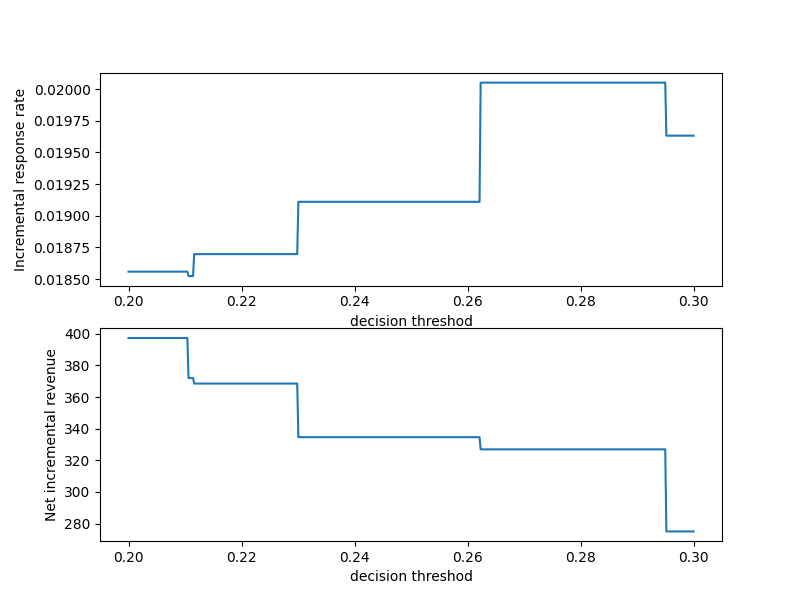

# Starbucks promotion strategy optimization

## Introduction
The dataset you will be provided in this portfolio exercise was originally used as a take-home assignment provided by Starbucks for their job candidates. The data for this exercise consists of about 120,000 data points split in a 2:1 ratio among training and test files. In the experiment simulated by the data, an advertising promotion was tested to see if it would bring more customers to purchase a specific product priced at $10. Since it costs the company 0.15 to send out each promotion, it would be best to limit that promotion only to those that are most receptive to the promotion. Each data point includes one column indicating whether or not an individual was sent a promotion for the product, and one column indicating whether or not that individual eventually purchased that product. Each individual also has seven additional features associated with them, which are provided abstractly as V1-V7.

In this project,
I performed the t-test to determine if the A/B testing dataset is statistically significant or practically significant.
I also used machine learning model to predict to whom Starbucks offers should be sent in order to maximize profit.

## Files
Starbucks.html: a jupyter notebook containing detailed data analysis and modelling process.

select_classifier.py: a module containing functions for selecting classifiers with best performance.

starbucks.py: a module containing implementation of the designed promotion strategy with machine learning model, and the optimal threshold for predicted probabilities is determined.

test.py: a module to test effectiveness of the designed promotion strategy by plotting IRR and NIR.

## Executing the program
Run starbucks.py to train the machine learning model in order to create the predictive model. 

Run test.py to test the effectiveness of the predictive model for our promotion strategy.

## Acknowledge 
Thanks to Starbucks for providing the dataset
